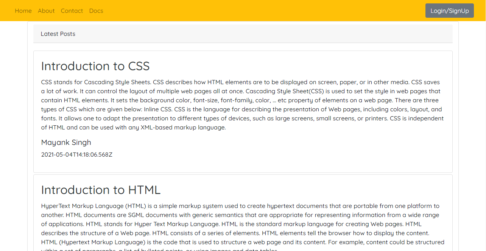
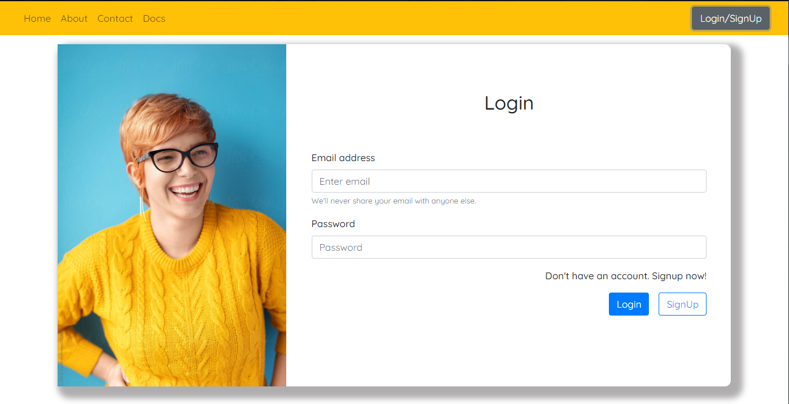
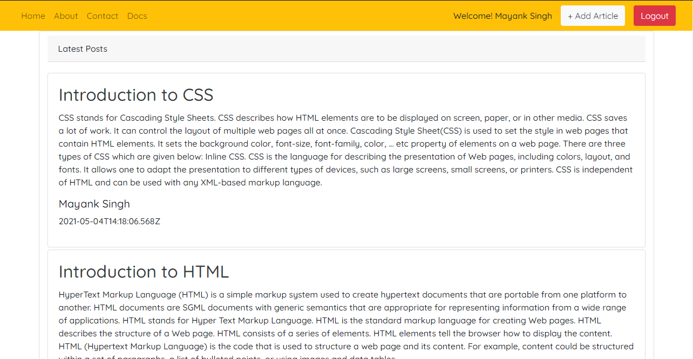
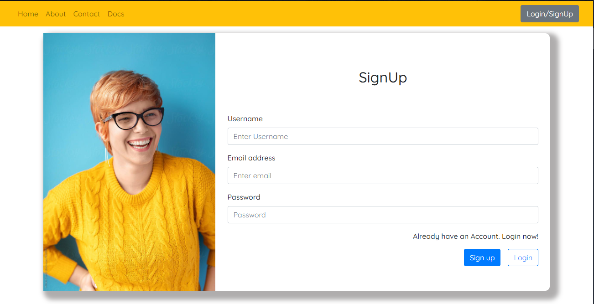
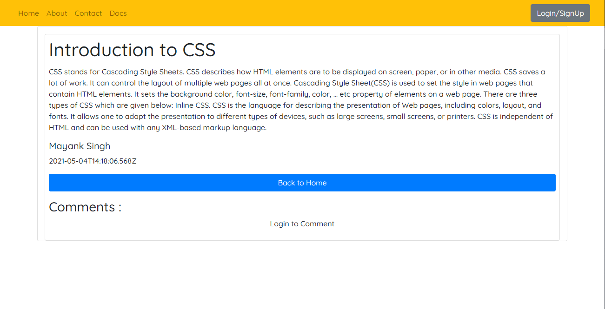
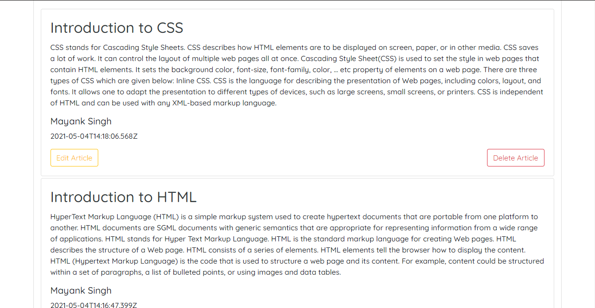

# WordIt - MERN Blogging Website

Hello, Welcome to our Docs!

WordIt is a MERN Blogging App.
MERN stands for MongoDB, Express, React, Node, after the four key technologies that make up the stack.


- MongoDB - document database.
- Express(.js) - Node.js web framework.
- React(.js) - a client-side JavaScript framework.
- Node(.js) - the premier JavaScript web server.

## Getting Started

### Info :

- WordIt is a MERN Blogging website.
- This is a blogging website where users cant create, edit ,delete and comment on the post
- Users are required to login first inorder to create and comment on posts.
- Frontend is created using React and have used Bootstrap for styling the website.
- Users can see all the Article posted on the website but in onder to comment login is required.
- No two user with same email address can login to the website. E-mail address must be unique.

### Technologies Used :

Some of the technologies used in the development of this web application are as follow:

- React - A JavaScript library for building user interfaces.
- MongoDB - A runtime environment to help build fast server applications using JS.
- Node js - Node.js is an open-source, cross-platform, back-end JavaScript runtime environment that runs on the V8 engine and executes JavaScript code outside a web browser.
- Express js - A popular Node.js framework to build scalable server-side for web applications.
- Html - HTML is the standard markup language for Web pages. With HTML you can create your own Website.
- CSS - CSS is the language we use to style an HTML document. CSS describes how HTML elements should be displayed.
- Bootstrap - Bootstrap is a free and open-source CSS framework directed at responsive, mobile-first front-end web development.

### Libraries Used :

Some of the libraries used in the development of this web application are as follow:

- axios - Axios is a popular, promise-based HTTP client that sports an easy-to-use API and can be used in both the browser and Node.js.
- cors - Cross-Origin Resource Sharing (CORS) is an HTTP-header based mechanism that allows a server to indicate any other origins (domain, scheme, or port) than its own from which a browser should permit loading of resources.
- react-router-doms - A tool that allows you to handle routes in a web app, using dynamic routing. Dynamic routing takes place as the app is rendering on your machine, unlike the old routing architecture where the routing is handled in a configuration outside of a running app.
- react-icons - Include popular icons in your React projects easily with react-icons, which utilizes ES6 imports that allows you to include only the icons that your project is using.
- Dotenv - Dotenv is a zero-dependency module that loads environment variables from a . env file into process. env . Storing configuration in the environment separate from code is based on The Twelve-Factor App methodology.
- mongoose - An ODM(Object Data Modelling)library for MongoDB and Node.js.
- nodemon - nodemon is a tool that helps develop node.js based applications by automatically restarting the node application when file changes in the directory.
- concurrently - Concurrently is a package which can run multiple npm scripts simultaneously.

## Installation

- Fork this repo and run the git clone command from your terminal/bash
- Create a `.env` file in the backend directory
- mongoDB_URI - Insert the correct connection URL for your MongoDB database

  `mongodb+srv://<username>:<password>@<username>.fxrpe.mongodb.net/BlogDB?retryWrites=true&w=majority`

- mongoDB_LOCAL - Insert the correct connection URL for your MongoDB database local

  `mongodb://localhost:27017/BlogDB`

#### Backend

- cd into backend and write npm install or npm i in command terminal

  ```
  $ cd backend
  $/backend npm install
  ```

#### Frontend

- cd into my-project and write npm install or npm i in command terminal

  ```
  $ cd my-project
  $/my-project npm install
  ```

- Write npm start to start the react server and backend

  ```
  $/my-project npm start
  ```

### Working

#### HomePage

User can view articles by other users and login/signup to our website.



#### Login Page

User can login to our website. If user is not found, error is generated .



#### Add Article Page

After logging in user can post article or comment on other articles to our website.



#### SignUp Page

User can signup to our website. No two user can have same email id.



#### Article Page

User can see full article and comment on the article.



### Edit/Delete

User can edit or delete their own posts.


